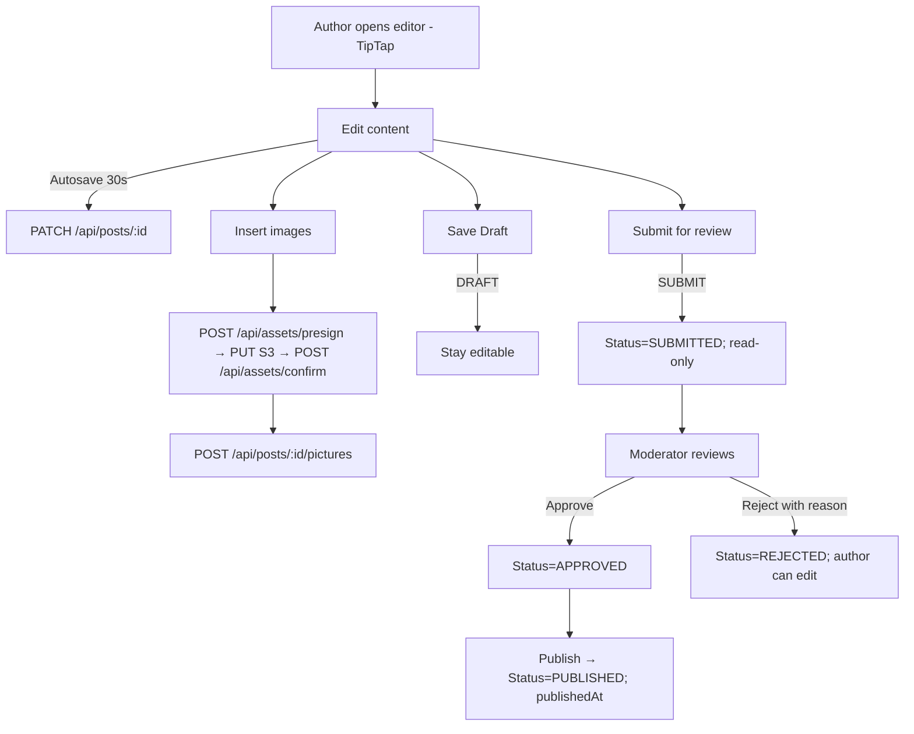

# Blog Post Creation — Specification & Vitest Test Plan

> Stack: **SvelteKit + Prisma (PostgreSQL) + Better Auth + TipTap + S3 (presigned uploads) + Vitest**

---

## Feature Specification

### User Stories

- **Drafting**: As an author, I can create and save drafts using a TipTap WYSIWYG editor.
- **Autosave**: Drafts autosave every **30s** while editing.
- **Assets**: I can upload images (to S3 via presigned URLs) and insert them into the post; a post can include **many images**.
- **Submission**: I can submit my draft for moderation; once submitted it becomes read‑only for me until reviewed.
- **Moderation**: As a moderator, I can approve or reject submissions and optionally add a rejection reason; approved posts can then be published.
- **Publishing**: Moderators can publish immediately (no scheduling in MVP).
- **Authentication/Authorization**: Access is restricted by **Better Auth** roles/permissions.

### Business Rules

- **No scheduling** in MVP.
- **Slug**: kebab‑case, **max 150 chars**, unique; on collision append `-2`, `-3`, …
- **Tags**: 0–**4** tags, token regex `/^[a-z0-9]+(?:-[a-z0-9]+)?$/i`, case‑insensitive de‑dupe.
- **Content**: stored as sanitized **HTML** and canonical **TipTap JSON** (server sanitizes HTML).
- **State machine**: `DRAFT → SUBMITTED → (APPROVED → PUBLISHED | REJECTED → DRAFT)`.
- **Images**: only the uploader (or admins) can reference an image; images referenced by a post are tracked in a junction table for integrity and ordering.

### Data Model (Prisma — PostgreSQL)

```prisma
model Post {
  id            String   @id @default(uuid())
  title         String
  slug          String   @unique @db.VarChar(150)
  contentHtml   String   // sanitized HTML
  contentJson   Json     // TipTap JSON document
  status        PostStatus @default(DRAFT)
  tags          String[] @db.Text
  authorId      String
  author        User     @relation(fields: [authorId], references: [id])
  submittedAt   DateTime?
  publishedAt   DateTime?
  createdAt     DateTime @default(now())
  updatedAt     DateTime @updatedAt
  pictures      PostPicture[]
  moderation    ModerationEvent[]
}

enum PostStatus { DRAFT SUBMITTED APPROVED REJECTED PUBLISHED }

model ImageAsset {
  id        String   @id @default(uuid())
  bucket    String
  key       String   // S3 object key
  url       String   // public or signed URL base
  mime      String
  sizeBytes Int
  userId    String
  user      User     @relation(fields: [userId], references: [id])
  createdAt DateTime @default(now())
  usedBy    PostPicture[]
  @@unique([bucket, key])
}

model PostPicture {
  id        String   @id @default(uuid())
  postId    String
  assetId   String
  sortOrder Int      @default(0)
  alt       String?  @db.VarChar(160)
  caption   String?
  post      Post      @relation(fields: [postId], references: [id])
  asset     ImageAsset @relation(fields: [assetId], references: [id])
  @@index([postId, sortOrder])
}

model ModerationEvent {
  id        String   @id @default(uuid())
  postId    String
  actorId   String   // moderator user id
  action    ModerationAction
  reason    String?
  createdAt DateTime @default(now())
  post      Post     @relation(fields: [postId], references: [id])
}

enum ModerationAction { SUBMIT APPROVE REJECT PUBLISH }
```

### Process Flow (Mermaid)



### API Contracts (SvelteKit)

- **POST `/api/posts`** → create draft
  - Body: `{ title, contentJson, contentHtml, tags: string[] (<=4) }`
  - 201: `{ id, slug, status }`

- **PATCH `/api/posts/:id`** → update draft (author only; blocked if SUBMITTED+)
  - Body: partial `{ title?, contentJson?, contentHtml?, tags? }`

- **POST `/api/posts/:id/submit`** → author submits for moderation
  - 200: `{ status:'SUBMITTED' }` + `ModerationEvent{SUBMIT}`

- **POST `/api/posts/:id/approve`** → moderator approves
  - 200: `{ status:'APPROVED' }` + `ModerationEvent{APPROVE}`

- **POST `/api/posts/:id/reject`** → moderator rejects
  - Body: `{ reason?: string }`
  - 200: `{ status:'REJECTED' }` + `ModerationEvent{REJECT, reason}`

- **POST `/api/posts/:id/publish`** → moderator publishes
  - 200: `{ status:'PUBLISHED', publishedAt }` + `ModerationEvent{PUBLISH}`

- **POST `/api/assets/presign`** → request presigned URL
  - Body: `{ filename, mime, sizeBytes }`
  - 200: `{ uploadUrl, headersOrFields, key, bucket }`

- **POST `/api/assets/confirm`** → finalize asset after upload
  - Body: `{ key, bucket, mime, sizeBytes }` → 201 `ImageAsset`

- **POST `/api/posts/:id/pictures`** → attach image(s) to post
  - Body: `{ assetIds: string[], startOrder?: number }` → 200 list of `PostPicture`

### Validation & Security

- **Zod schemas** enforce: title (1..200), slug ≤150 (derived), tags 0..4, contentHtml present & sanitized.
- **Sanitization** (server): allow `p,h1–h6,ul,ol,li,a,strong,em,blockquote,code,pre,img,hr,br` and attributes `href,rel,target,class,src,alt`. Allow code blocks (`pre > code[class]`).
- **Better Auth**: mockable session provider in tests; role gates for author/moderator routes.
- **Ownership**: only the uploading user (or moderators) can attach an `ImageAsset` to a post.

---

## Vitest Test Strategy

### Tooling

- `vitest` + `@testing-library/svelte` + `@testing-library/user-event`
- DOM env: `happy-dom`
- DB: Prisma against ephemeral Postgres (or SQLite compat in CI) with migration reset per suite
- **Better Auth mock**: mock `getSession()` to emit `{ user: { id, roles: ['author'|'moderator'] } }`
- **S3 mock**: mock presign service and HTTP PUT; confirm `ImageAsset` DB write on `confirm`
- Clock control: `vi.useFakeTimers()` for **30s autosave**

### Unit Tests

- **Slug**
  - trims & kebab‑cases; truncates to 150; de‑dupes with suffixes

- **Schemas**
  - `postInput`: requires `contentHtml`+`contentJson`; tags ≤4; rejects empty content
  - `assetInput`: validates mime/size (basic for now; detailed later)

- **Sanitizer**
  - strips disallowed tags/attrs; preserves `pre > code[class]`; rewrites external links with `rel="noopener"`

### Integration Tests (API + Prisma)

- **Draft lifecycle**
  - create draft (author) → 201
  - update draft (author) → 200
  - submit (author) → 200 + event{SUBMIT}; author cannot PATCH afterward
  - approve (moderator) → 200 + event{APPROVE}
  - publish (moderator) → 200 + event{PUBLISH}; sets `publishedAt`
  - reject (moderator) → 200 + event{REJECT, reason}; author can edit again

- **AuthZ**
  - non‑auth → 401; wrong role → 403

- **Assets**
  - presign → client PUT (mock) → confirm creates `ImageAsset`
  - attach images to post → creates `PostPicture` with correct ordering; only owner (or moderator) can attach

### Component Tests (Svelte)

- **PostEditor.svelte (TipTap)**
  - renders toolbar (bold, italic, heading, code block)
  - autosaves after **30s** of inactivity (fake timers)
  - submit button locks editor (read‑only) and hides autosave
  - image picker lists only user’s assets; selecting inserts `` in editor and posts `/pictures`

- **ImageUpload.svelte**
  - selects file → calls `/api/assets/presign` → (mock) PUT → `/api/assets/confirm`
  - invalid type/size shows inline errors

### Test Matrix (Selected)

| ID    | Layer       | Scenario             | Expected                                    |
| ----- | ----------- | -------------------- | ------------------------------------------- |
| T-001 | Unit        | slug ≤150            | truncated & deduped slug                    |
| T-010 | Unit        | sanitize code blocks | `<pre><code class="language-ts">` preserved |
| T-020 | Integration | submit locks editing | PATCH after SUBMITTED → 403                 |
| T-021 | Integration | approve→publish      | status transitions + events + `publishedAt` |
| T-030 | Integration | presign→confirm      | ImageAsset row created                      |
| T-031 | Integration | attach images        | PostPicture rows with correct order         |
| T-040 | Component   | autosave 30s         | editor issues PATCH on timer                |
| T-041 | Component   | image insert         | selected asset appears in contentHtml       |

---

## Example Schemas (zod)

```ts
// src/lib/posts/schema.ts
import { z } from 'zod';
export const tagsSchema = z
	.array(z.string().regex(/^[a-z0-9]+(?:-[a-z0-9]+)?$/i))
	.max(4)
	.default([]);
export const postInput = z.object({
	title: z.string().trim().min(1).max(200),
	contentHtml: z.string().min(1),
	contentJson: z.any(), // TipTap JSON; shape validated by editor lib if needed
	tags: tagsSchema
});
```

```ts
// src/lib/assets/schema.ts
import { z } from 'zod';
export const presignInput = z.object({
	filename: z.string(),
	mime: z.string(),
	sizeBytes: z.number().int().positive()
});
export const confirmInput = z.object({
	key: z.string(),
	bucket: z.string(),
	mime: z.string(),
	sizeBytes: z.number().int().positive()
});
```

---

## Better Auth (tests)

```ts
// tests/setup.auth.ts
import { vi } from 'vitest';
vi.mock('$lib/server/auth', () => ({
	getSession: vi.fn(() => ({ user: { id: 'u1', roles: ['author'] } })),
	requireRole: vi.fn((role: string) => {
		/* throw 403 if absent */
	})
}));
```

---

## CI Notes

- Reset DB per run: `prisma migrate reset --force`
- Run tests: `vitest --run --coverage`
- Artifacts: coverage HTML

---

## Error Handling & HTTP Responses

### Principles

- **Fail fast, explain clearly**: machine‑readable error codes + human‑readable messages.
- **Consistent shapes** across endpoints.
- **Client UX**: inline field errors for validation, non‑blocking toasts for transient/system issues, and safe retry with backoff where applicable.
- **No silent data loss**: autosave conflicts are surfaced with a clear prompt to merge/retry.

### Standard Error Shapes

```jsonc
// Validation (422)
{
  "error": "VALIDATION_ERROR",
  "message": "One or more fields are invalid.",
  "fieldErrors": {
    "title": ["Title is required"],
    "tags": ["At most 4 tags"],
    "contentHtml": ["Content required"]
  }
}

// AuthZ/AuthN (401/403)
{
  "error": "UNAUTHORIZED",               // or FORBIDDEN
  "message": "Login required."            // or "Moderator role required."
}

// Conflict (409)
{
  "error": "CONFLICT",
  "message": "Slug already exists.",
  "conflict": { "field": "slug", "value": "my-post" }
}

// Generic server error (5xx)
{
  "error": "INTERNAL_ERROR",
  "message": "Something went wrong. Please try again."
}
```

### HTTP Status Codes by Area

- **Create/Update Post**
  - `201` Created — post created (draft or submitted)
  - `200` OK — draft updated
  - `401` Unauthorized — no session
  - `403` Forbidden — editing not allowed in current state (e.g., SUBMITTED)
  - `409` Conflict — slug collision when creating
  - `422` Unprocessable Entity — zod validation failed (title, tags, contentHtml)
  - `429` Too Many Requests — autosave throttled (rate‑limit guard)
  - `500` Internal Error — unexpected failure

- **Moderation (submit/approve/reject/publish)**
  - `200` OK — transition applied
  - `401` Unauthorized — no session
  - `403` Forbidden — moderator role required
  - `404` Not Found — post id invalid or state doesn’t allow transition (e.g., approve when not SUBMITTED)
  - `409` Conflict — concurrent state change detected (ETag/version mismatch)
  - `422` Unprocessable Entity — reject without valid reason (if reason required by policy)
  - `500` Internal Error

- **Assets (presign/confirm/attach)**
  - `200` OK / `201` Created — presign/confirm/attach succeeded
  - `400` Bad Request — bad filename/mime/size
  - `401` Unauthorized — no session
  - `403` Forbidden — attaching asset not owned by user
  - `413` Payload Too Large — exceeds configured size
  - `415` Unsupported Media Type — mime not allowed
  - `422` Unprocessable Entity — schema validation failure
  - `502/503/504` — upstream S3 issues/timeouts (surfaced as retriable)

### Client UX & Handling

- **Validation (422)**
  - Map `fieldErrors` to inputs (title, tags, content). Focus the first invalid field; keep other input intact.
  - Display a small banner or inline helper; avoid toast unless it’s a form‑wide issue.

- **Auth (401/403)**
  - 401 → redirect to login (preserve returnTo). 403 → show “insufficient permissions” page with link to dashboard.

- **Conflicts (409)**
  - On slug conflict during create: automatically re‑slug with suffix (`-2`, `-3`, …) and retry once; if it still fails, show inline slug edit with warning.
  - On moderation/state version conflicts: refetch post, show non‑blocking toast “This post changed in the background,” and disable conflicting action.

- **Autosave**
  - Use `If-Match`/`ETag` (or `updatedAt` guard) on autosave PATCH. If mismatch → prompt to reload/merge, do **not** overwrite silently.
  - Backoff on `429` (exponential with jitter), resume after cool‑down.

- **Assets**
  - Presign failure → show inline error on uploader and allow retry.
  - S3 PUT failure (network/timeout) → mark item as failed with retry button.
  - Confirm failure → show toast with “Retry confirm” and keep temp preview until confirmed.
  - Attach failure (403/422) → revert inserted image and surface message.

- **System/Unknown (5xx)**
  - Show toast: “Something went wrong. Try again.” Provide “Retry” for idempotent actions.
  - Log client error event for observability.

### Logging & Observability

- Log at server: request id, user id, route, status, error code, timing.
- Redact PII and content body; include post id and moderation action.
- Emit metrics: rate of 4xx/5xx per route; autosave success ratio; S3 presign/confirm latency.

### Example Error Mappings

- **Title missing** → 422 with `fieldErrors.title` → show inline message under Title.
- **Moderator only** → 403 → show lock icon + tooltip on action buttons, disabled state.
- **Image too large** → 413 → uploader shows “Max size X MB”; block confirm.
- **Post not SUBMITTED on approve** → 404/409 (policy dependent) → refetch and show status chip update.

---

## Open Items (tracked)

1. Asset constraints (size/mime/quotas) — codify later.
2. Exact TipTap extensions set (code block, link, image, heading, list, blockquote, horizontal rule).
3. Sanitizer allowlist tune‑ups (tables? inline code vs fenced?).
